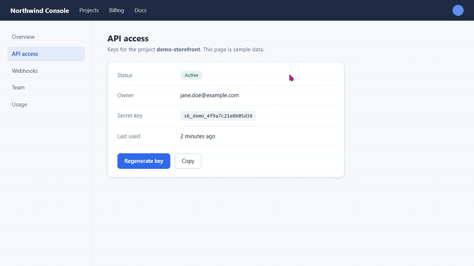

# ScreenPick

**Screenshot capture and annotation for Windows and macOS.** Press a shortcut,
select a region, a window or a display, mark it up, and copy it.



**[Download for Windows or macOS](https://github.com/tstone-1/screenpick/releases/latest)**
&nbsp;·&nbsp; free and open source &nbsp;·&nbsp; no account &nbsp;·&nbsp; no telemetry

ScreenPick is a small tray app. It stays out of the way until a shortcut calls
it, and the only network request it makes is the check for a new version.

## Features

- **Capture modes** — region select, window pick (click the window you want),
  full screen, pick-a-display, and a screen color picker.
- **Annotation editor** — straight and bent arrows, shapes, freehand pen, text,
  highlighter, blur, crop, and cut, with undo/redo, pan, and zoom.
- **Global shortcuts** — trigger any capture mode from anywhere without focusing
  the app; shortcuts are configurable in Settings.
- **Clipboard & file export** — copy the result straight to the clipboard or save
  it, with a Recent captures list for quick re-export.
- **Lives in the tray** — stays out of your way and can start hidden at login.
- **Native capture backends** — uses the OS compositor for correct, crisp
  captures of GPU-composited windows on both platforms.

## Install

Download the latest installer from the
[Releases](https://github.com/tstone-1/screenpick/releases) page:

- **macOS:** `ScreenPick_<version>_universal.dmg` (one file, runs on Apple
  Silicon and Intel)
- **Windows:** `ScreenPick_<version>_x64-setup.exe` (installs for your user
  account, no administrator rights; code-signed, see below)

The `.sig`, `.tar.gz` and `latest.json` files beside them belong to the built-in
updater; you do not need them. There is no `.msi` any more: if you installed
ScreenPick from one, uninstall it once in Windows **Settings → Apps** and
install the `-setup.exe`.

### macOS first launch

From **26.7.6** onward the macOS build is signed with an Apple Developer ID and
notarized by Apple, so there is nothing to bypass:

1. Open the `.dmg` and drag **ScreenPick** into **Applications**.
2. Double-click ScreenPick. It opens normally.
3. **Grant Screen Recording permission.** On first capture, macOS asks for it
   (or open **System Settings → Privacy & Security → Screen Recording** and
   enable ScreenPick). Relaunch the app afterwards — without this permission,
   captures come out black.

<details>
<summary>Installing <b>26.7.5 or earlier</b>? Those builds are unsigned and need a Gatekeeper bypass.</summary>

Older releases were not signed, so macOS blocks them on first launch. The app is
fine — macOS just cannot verify the publisher. After the `.dmg` step above:

**Option A — Terminal (most reliable).** Removes the download quarantine flag:

```sh
xattr -dr com.apple.quarantine /Applications/ScreenPick.app
open /Applications/ScreenPick.app
```

**Option B — no Terminal.** Double-click ScreenPick. When macOS refuses, go to
**System Settings → Privacy & Security**, scroll to the message about ScreenPick
being blocked, and click **Open Anyway**. Confirm once more when prompted.

If you see **"ScreenPick is damaged and can't be opened"**, the app is *not*
actually damaged — that is the quarantine message for unsigned apps. Use
**Option A** to clear it.

</details>

### Windows first launch

Releases after **26.10.2** are code-signed: the publisher reads *Open Source
Developer Timo Stein*. The certificate is new, so Windows can still show
**"Windows protected your PC"** the first time you run the installer: choose
**More info**, check the publisher, then **Run anyway**. Whether a computer with
Smart App Control switched on accepts it has not been tested. The installer is
built and signed from this repository by the public
[release workflow](.github/workflows/release.yml);
[Code signing policy](#code-signing-policy) has who signs and what.

**26.10.2 and earlier** are unsigned. SmartScreen shows the same dialog for
them, with an unknown publisher: **More info → Run anyway**.

## Updates

From **26.7.6** onward ScreenPick updates itself. It checks for a new version
shortly after launch, and offers it in a banner with an **Install and restart**
button. You can also check on demand from **Settings → Check for updates** or
the tray menu.

Every update is cryptographically signed, and ScreenPick verifies that
signature before installing — so an update can only come from this project.
That signature is separate from Apple and Windows code signing: it protects the
update payload itself, on both platforms.

- **Turn it off:** Settings → *Check for updates at startup*. Manual checks
  still work. The automatic check contacts GitHub, which is the only network
  request ScreenPick makes.
- **Windows portable `.exe`:** cannot self-update — download a new one, or use
  the installer.

<details>
<summary>Coming from a version <b>before 26.7.6</b>?</summary>

- Those builds have no updater. Install the latest release manually once;
  updates are automatic after that.
- **macOS Screen Recording permission across updates:** signed builds keep it.
  Unsigned builds did not — macOS treated every update as a different app and
  silently dropped the grant. **Updating *to* 26.7.6 breaks it one last time**,
  because the app's signing identity itself changes; from then on it survives.
  If captures come out black after that update, go to **System Settings →
  Privacy & Security → Screen & System Audio Recording**, **remove ScreenPick
  from the list and add it again** — the switch often still looks enabled.
  ScreenPick shows a banner explaining this when it detects the situation.

</details>

## Code signing policy

Windows releases after 26.10.2 are signed with a
[Certum](https://www.certum.eu/) Open Source Code Signing certificate issued to
the maintainer. Windows shows the publisher as *Open Source Developer Timo
Stein*. 26.10.2 and the releases before it are unsigned on Windows. macOS
releases use Apple Developer ID signing and notarization.

The committer, reviewer and release approver is
[Timo Stein (tstone-1)](https://github.com/tstone-1). Nobody else can sign.

- **What is signed.** The installer, `screenpick.exe` and the uninstaller. All
  three are built from this repository. No file from anywhere else is signed
  for a ScreenPick release.
- **Where.** Only in the public
  [release workflow](.github/workflows/release.yml), on a GitHub-hosted runner,
  for a version tag the maintainer pushes. The workflow reads the installer's
  signature back, installs it, reads the signature of every executable it
  installed, and fails if one is missing or not his.
- **Approval.** The workflow produces a draft. The maintainer checks it and
  publishes it by hand; nothing reaches a reader without that step.
- **The key.** It is held in Certum's signing service and cannot be exported.
  The login to that service is a secret of this repository that only the
  release workflow and its rehearsal can read, and a pull request cannot. The
  GitHub account uses two-factor authentication, and every login to the signing
  service needs a one-time code.

### Privacy

ScreenPick has no account, no analytics and no telemetry, and it uploads no
capture. The one network request it makes is the check for a new version: an
ordinary HTTPS request to GitHub, which carries the connection's IP address and
request metadata and is covered by GitHub's
[privacy statement](https://docs.github.com/en/site-policy/privacy-policies/github-general-privacy-statement).
**Settings → Check for updates at startup** turns the automatic check off.

## Command line

The installed program also takes commands, so a script, a launcher or a
stream-deck button can drive it.

```sh
screenpick capture region        # open the region selector
screenpick capture window        # capture the active window
screenpick capture screen        # capture the display under the cursor
screenpick capture screen-pick   # open the display picker
```

These do what the mode's global shortcut does, in the running ScreenPick. If it
is not running, the command starts it in the tray first.

With `--output`, the capture is taken at once, without any window, and written
to a PNG. ScreenPick does not need to be running, and the capture does not
appear in Recent:

```sh
screenpick capture screen --output shot.png
screenpick capture screen --display 2 --output shot.png
screenpick capture region --rect 100,200,800,600 --output part.png
screenpick displays              # the numbers --display takes
```

`--rect` is `x,y,width,height` from the top-left corner of the display, in the
units `screenpick displays` prints. `--output` can be written `-o`, and the
long options also take their value as `--output=shot.png`; each option may be
given once. An existing output file is replaced, and only once the capture is
complete: a capture that fails leaves the old file as it was. The exit code is
0 on success, 1 when the capture failed and 2 when the command line is wrong;
`screenpick --help` lists everything.

Where the program is:

- **Windows:** `%LOCALAPPDATA%\ScreenPick\screenpick.exe`. It is a window
  program, so a terminal does not wait for it: in PowerShell, append
  `| Out-Host` to see the output before the next prompt and to get
  `$LASTEXITCODE`; in `cmd`, use `start /wait`.
- **macOS:** `/Applications/ScreenPick.app/Contents/MacOS/screenpick`.

## Build from source

Prerequisites: [Node.js](https://nodejs.org/) 24+ (with npm) and the
[Rust toolchain](https://www.rust-lang.org/tools/install) via `rustup`, plus your
platform's [Tauri prerequisites](https://v2.tauri.app/start/prerequisites/).

```sh
npm install          # install JS dependencies
npm run tauri dev    # run the desktop app in dev mode
npm run tauri build  # produce installers for the current platform
```

Frontend-only and check/test commands:

```sh
npm run dev          # run the frontend only in a browser at http://localhost:1420
npm run build        # build the frontend bundle
npm run check        # type and Svelte checks
npm run test         # frontend checks, unit tests, and Rust tests
```

See [BUILD.md](BUILD.md) for the full build, test-gate, and release procedure.

## Troubleshooting

ScreenPick writes a diagnostic log (failures and key lifecycle events) to the
OS log directory. Attach it when reporting a bug:

- **Windows:** `%LOCALAPPDATA%\com.tstone1.screenpick\logs\`
- **macOS:** `~/Library/Logs/com.tstone1.screenpick/`

If your saved preferences ever reset on their own, the log (and a startup
notification) will say why, and the previous settings file is preserved next to
the current one as `capture-settings.invalid-*.json`.

At startup, ScreenPick moves any saved-document folder that its index does not
list into `documents/recovered/<id>` inside the app data directory instead of
deleting it. Each such folder holds `base.png` (the original capture),
`current.png` (the capture with its annotations) and `annotations.json`. Nothing
removes this folder automatically, so you can copy the PNGs out and then delete
it. The app data directory is `%LOCALAPPDATA%\com.tstone1.screenpick\` on Windows
and `~/Library/Application Support/com.tstone1.screenpick/` on macOS.

## Tech stack

- [Tauri 2](https://v2.tauri.app/) desktop shell (Rust, `src-tauri/`).
- [Svelte 5](https://svelte.dev/) + SvelteKit + TypeScript frontend (`src/`).
- Vite for bundling, Vitest for frontend unit tests, `cargo test` for Rust.
- Typed IPC between Rust and the frontend via `tauri-specta` (Rust is the source
  of truth for command and event shapes).

## Recommended IDE

[VS Code](https://code.visualstudio.com/) with the
[Svelte](https://marketplace.visualstudio.com/items?itemName=svelte.svelte-vscode),
[Tauri](https://marketplace.visualstudio.com/items?itemName=tauri-apps.tauri-vscode),
and
[rust-analyzer](https://marketplace.visualstudio.com/items?itemName=rust-lang.rust-analyzer)
extensions.

## License

[MIT](LICENSE) © Timo Stein
